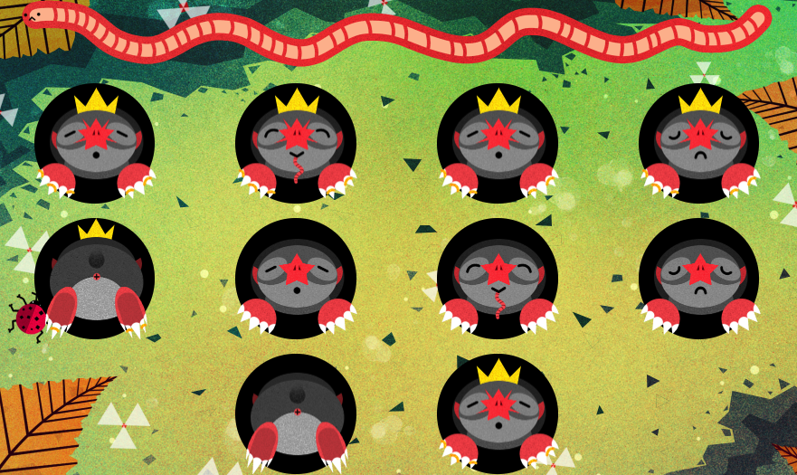

# Feed-A-Star-Mole



## Description
"Feed-A-Star-Mole" is an engaging, web-based game where players interact with animated moles popping out of holes. The objective is to 'feed' these moles by clicking on them, earning points for each mole fed. The game features two types of moles: regular and rare royal moles, with the latter providing double points. Players win the game by accumulating 10 points. This project is a delightful blend of fun and interactive design, built with modern web technologies.

## Technologies Used
- HTML
- CSS
- JavaScript

## Live Demo

```
[https://www.ayhanmetin.eu/feed-a-mole/index.html](https://feed-a-mole-red.vercel.app/)https://feed-a-mole-red.vercel.app/
```


